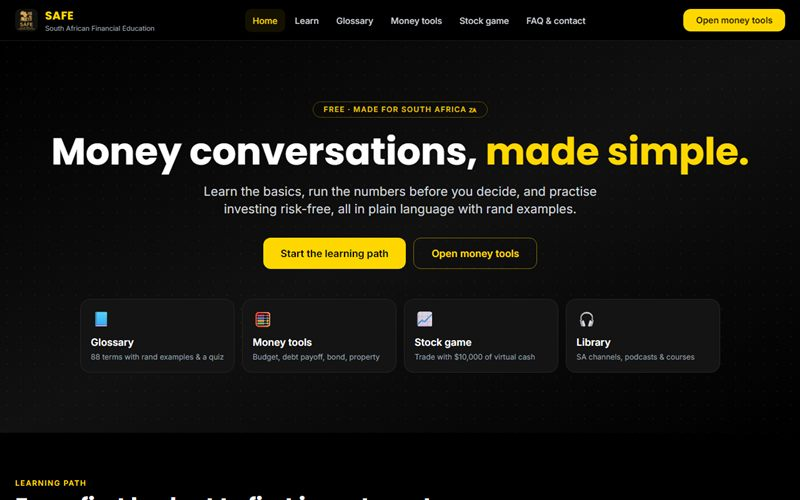

# SAFE: South African Financial Education

    

**Free, beginner-friendly financial education for South Africans**, in one place. It was my solo entry (Team Arctic) to the **South African Intervarsity Hackathon 2025**.

**Live site:** https://letlhogonolo-kgatshe.github.io/SAFE/



## Why I built it

When I started learning about money, the useful resources were scattered across dozens of sites, channels and podcasts. SAFE is the site I wish I'd had: the basics explained simply, tools to try ideas risk-free, and the local resources I still use, all on one page.

## Features

| Page | What it offers |
|---|---|
| **Home** | A 12-step learning path from first budget to first investment (progress saved), a live rand snapshot, a term of the day and featured SA creators |
| **Learn** | 47 curated YouTube channels, podcasts, sites and courses, with screenshots and the creators' own descriptions, filterable by format, topic and SA/Global |
| **Glossary** | 88 South African money terms with rand examples, levels, related terms, search, saved terms, shareable links and a flashcard quiz |
| **Money tools** | Budget planner, debt payoff (snowball vs avalanche), savings goal, net worth tracker, investment growth, loan & bond, property costs (SARS transfer duty) and a live currency converter |
| **Stock game** | Trade 5 fictional companies over 20 days with $10,000 of virtual cash: news-driven prices, P/L, achievements and an end-of-game summary |
| **FAQ & contact** | 24 searchable answers (TFSA, two-pot, credit, debt review, offshore, property, crypto tax), the WhatsApp community and a contact form |

Everything works on phones, and all personal inputs (budgets, saved terms, game progress) stay in the visitor's browser.

> **Disclaimer:** SAFE provides financial *information*, not financial advice. For personalised advice, consult a professional registered with the FSCA.

## Tech

A static site: **HTML**, **Tailwind CSS** (CDN), vanilla **JavaScript** and **Chart.js**. Live rates come from the free currency-api. It has no build step and is deployed to GitHub Pages with GitHub Actions (`.github/workflows/static.yml` publishes `src/`).

## Running locally

```bash
npx http-server src -p 5501
```

Then open http://localhost:5501. You can also open `src/index.html` directly in a browser.

## Repository layout

```
src/              The website: index, learn, glossary, tools, game and faq pages
src/assets/       Shared layout (site.js), styles (site.css), Tailwind theme, money tools
src/data/         Glossary terms and learning library (edit these to add content)
src/img/library/  Screenshots of library channels and sites
demo/       Hackathon presentation (.pptx), screen recording and overview
docs/       Setup, usage, team and acknowledgements
assets/     Screenshot and sponsor artwork
```

## Author

Built by **Letlhogonolo Kgatshe**, Computer Science student at IIE Varsity College, Cape Town. [Portfolio](https://letlhogonolo-kgatshe.github.io/) · [LinkedIn](https://www.linkedin.com/in/letlhogonolo-kgatshe-69aa2a2b7/)

Licensed under the [MIT License](LICENSE).
